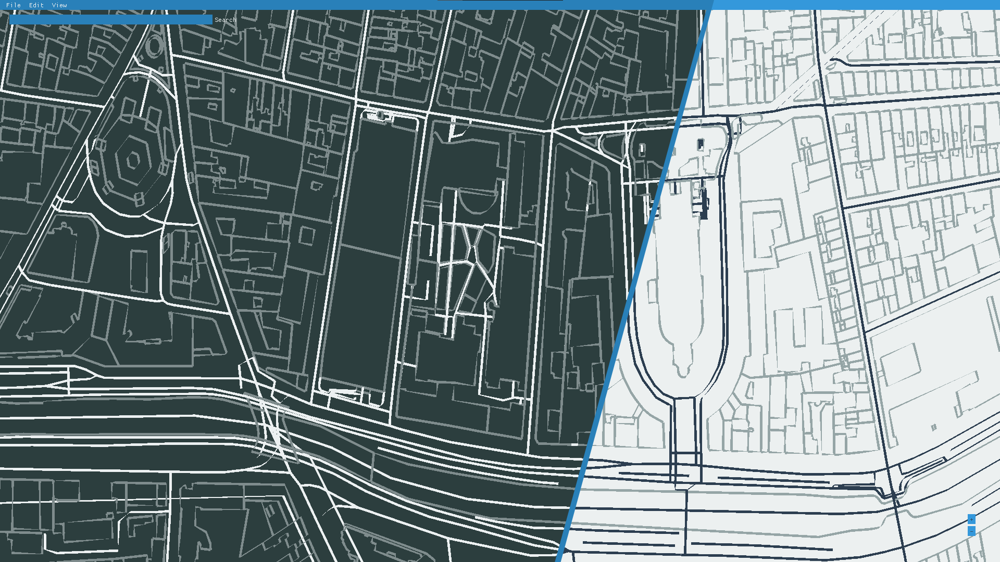

# 7map

An app for editing and reading maps from your computer.
*Disclaimer : This project is still a work in progress🚧, do not expect it to be fully functional*

- [7map](#7map)
  - [Project advancement](#project-advancement)
  - [Screenshots](#screenshots)
    - [Main app](#main-app)
    - [3D engine](#3d-engine)
  - [Installation](#installation)
  - [Usage](#usage)
  - [Contributors](#contributors)

## Project advancement

The App is able to display maps in OSM format.

## Screenshots

### Main app

**App.java** : display of our favorite place on Earth, showing both dark and light theme of the app!

### 3D engine

**Demo.java** : a quick overview of the capabilities of the rendering engine

## Installation

You'll need :

- a computer running Windows/Linux (macOS untested) 
- a [fresh jdk installation](https://www.oracle.com/java/technologies/javase-jdk16-downloads.html)
- maven (you can install the packages yourself but that's basically suicide because there's a high chance of you missing a couple of them)
- some patience (*optional*)

Anyways, once you're done gathering the aforementioned stuff, just clone the repository and run either **Demo.java** or **App.java**

If you did the things right, you should get something that looks approximately like the screenshots shown above.

## Usage

Please refer to the [user manual](doc/manuel-utilisateur.md).

## Contributors

A big shoutout to the 7map team working hard on this project *(don't mind the dependabot he isn't part of it, still helpful though)*

