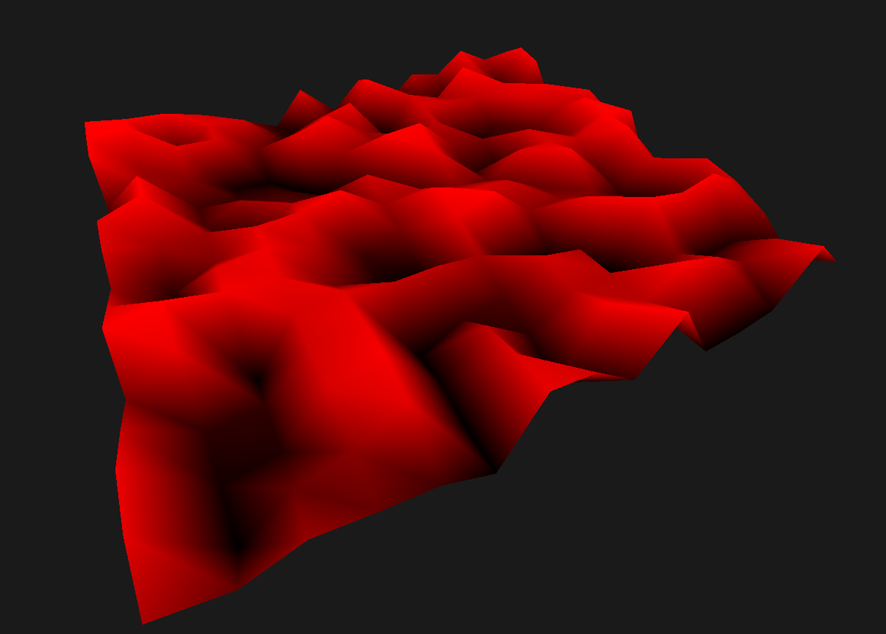
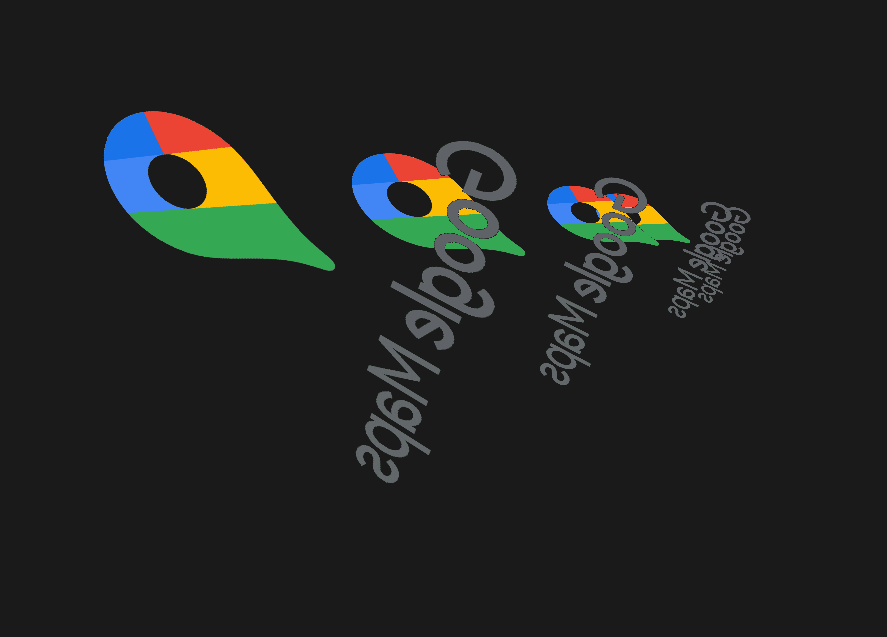

  

# 7map
An app for editing and reading maps from your computer. 
*Disclaimer : This project is still a work in progress, do not expect to be fully functional*

## Project advancement
The 3D engine is ready and works pretty well, the data team is still working on the back-end (database management and element loading/unloading from the scene) 

## Screenshots

**Demo.java** : a quick overview of the capabilities of the rendering engine

**App.java** : Texture transparency tests (yes we did use the google maps logo, *ironic isn't it ?*)

## Installation

You'll need : 

- a computer running Windows/Linux (MacOS untested) 
- a [fresh jdk installation](https://www.oracle.com/java/technologies/javase-jdk16-downloads.html)
- maven (you can install the packages yourself but that's basically suicide because there's a high chance of you missing a couple of them)
- some patience (optional)

Anyways, once you're done gathering the aforementioned stuff, just clone the repository and run either **Demo.java** or **App.java**

If you did the things right, you should get something that looks approximately like the screenshots shown above.

## Contributors

A big shoutout to the 7map team working hard on this project *(don't mind the dependabot he isn't part of it, still helpful though)*

