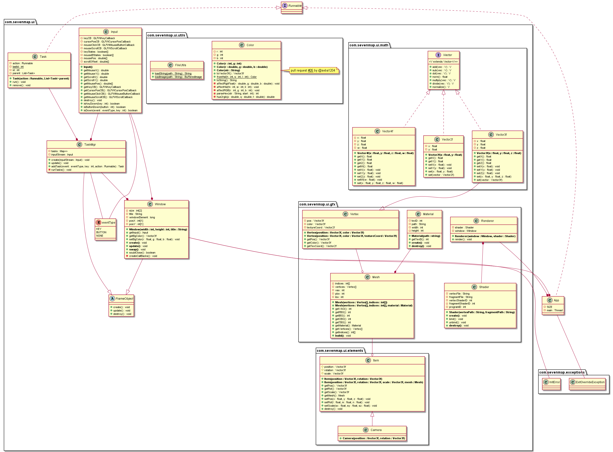

# Rapport de l'application 7map

## Sommaire

- [Rapport de l'application 7map](#rapport-de-lapplication-7map)
  - [Sommaire](#sommaire)
  - [Organisation et répartition du travail](#organisation-et-répartition-du-travail)
    - [Partie ``rendering``](#partie-rendering)
    - [Partie ``data``](#partie-data)

## Organisation et répartition du travail

Le processus de développement a été divisé en deux parties principales :

- rendering : affichage et rendu 3D
- data : gestion des données de l'application

Une équipe a été affectée à chaque partie.

Nous avons décidé de travailler avec git et Github pour des raisons de praticité.
Les noms d'utilisateurs Github de chacun des membres sont listés ci-dessous.

|             Team Rendering             |         Team Data          |
| :------------------------------------: | :------------------------: |
|    Philippe Negrel-Jerzy (@l3alr0g)    |   Félix Parain (@FaislX)   |
|       Hamid Oukhnini (@Mmzhk21)        | Selma Oujid  (@selmaoujid) |
| Mohamed M'Hand Ouammi    (@kingussopp) | Sébastien Pont (@seba1204) |

### Partie ``rendering``

Nous avons étudié en détail l'API de [LWJGL](https://www.lwjgl.org/) (librairie graphique java s'apparentant à OpenGL) afin de cerner les possibilités qu'elle nous offre. Par la suite, nous avons mis en place un moteur de rendu rudimentaire permettant l'affichage de figures en 3D et de textures.

En l'état actuel des choses, l'application est une démonstration simple des capacités du moteur.

Voici le diagramme UML qui lui est associé.

### Partie ``data``

Le but de notre équipe est de fournir à l'équipe "rendering" les données nécessaires à l'affichage. Nous devons convertir des données sources (json) en objet Java utilisable par LWJGL.

Voici notre diagramme UML :

Les objets de la carte sont des `feature`, par exemple l'ENSEEIHT, la D314, ...

Chaque `feature` est reliée à une `category`, par exemple 'école', 'route', ...

`Map` est la classe qui fait le lien entre l'affichage et la gestion des données.
Elle détermine les `feature` à afficher, et les convertit en `Mesh`.

Nous avons décidé d'utiliser le standard GeoJson pour le stockage des données.

Nous avons créé un parseur convertissant les `features` (objet GeoJson) à l'aide de la librairie [jackson](https://mvnrepository.com/artifact/com.fasterxml.jackson.core/jackson-databind).
